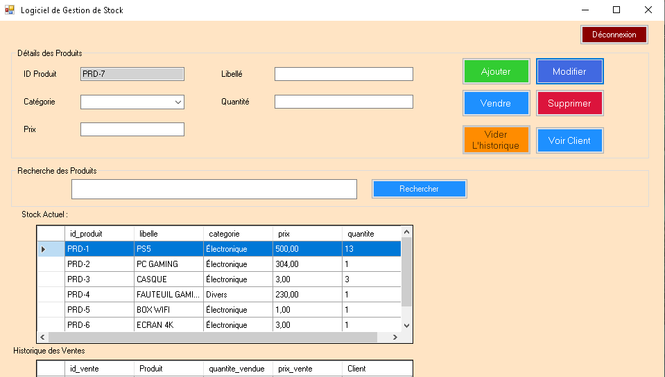

GSTOCK est une application de bureau complète conçue pour simplifier la gestion des stocks et le suivi des ventes. Développée avec une architecture robuste, cette application offre une interface intuitive pour les commerçants et les gestionnaires.

##  Fonctionnalités
- **Gestion des Clients** : Enregistrement, affichage et export de la liste des clients.
- **Suivi des Ventes** : Interface dédiée pour effectuer des transactions rapidement.
- **Base de Données en Temps Réel** : Intégration complète avec MySQL pour une persistance fiable des données.
- **Export PDF** : Génération de rapports et de listes de clients au format PDF.
- **Interface Professionnelle** : Design soigné avec une navigation intuitive.

## Technologies Utilisées
- **Langage** : VB.NET
- **Framework** : .NET Framework 4.5
- **IDE** : Visual Studio 2012
- **Base de données** : MySQL via XAMPP (phpMyAdmin)

Installation et Configuration

**Base de données** :
   - Installer XAMPP.
   - Créer une base de données nommée `gestion_stock` dans phpMyAdmin.
   - Importer le fichier `gestion_stock.sql` fourni dans ce dépôt.

**Application** :
   - Cloner le dépôt ou télécharger le dossier `Release`.
   - Assurez-vous que le fichier `MySql.Data.dll` est présent dans le même dossier que l'exécutable.
   - Lancer `GSTOCK.exe`.

## Un visuel

## Licence
Ce projet est sous licence MIT - voir le fichier [LICENSE](LICENSE) pour plus de détails.

---
Développé avec passion à **Pointe-Noire**.
